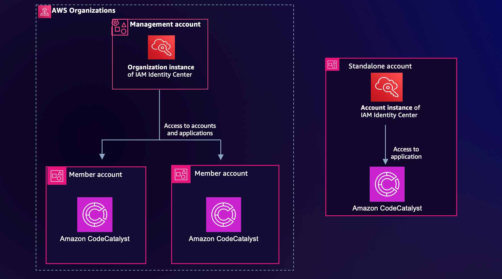
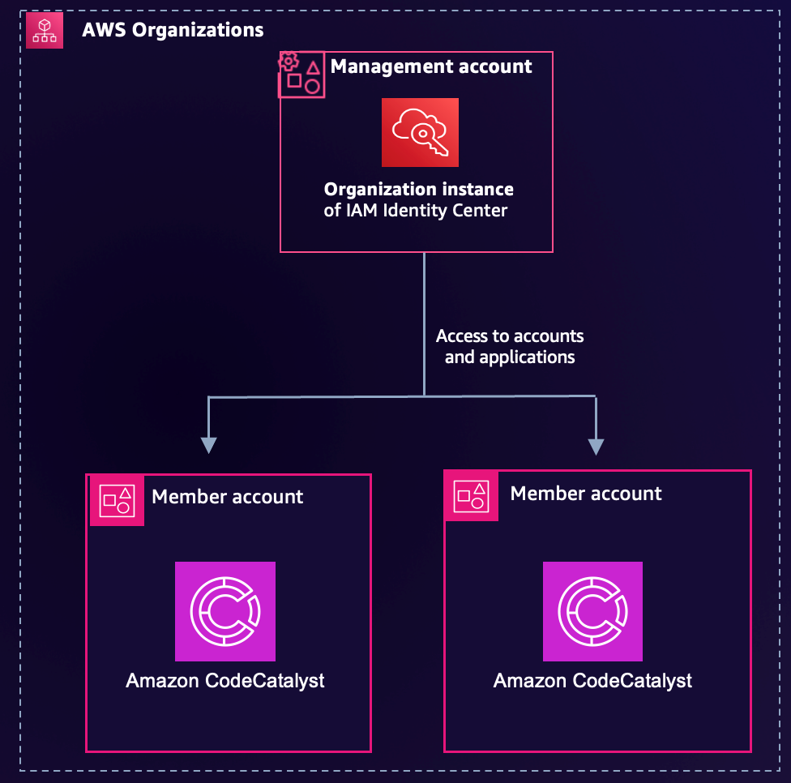
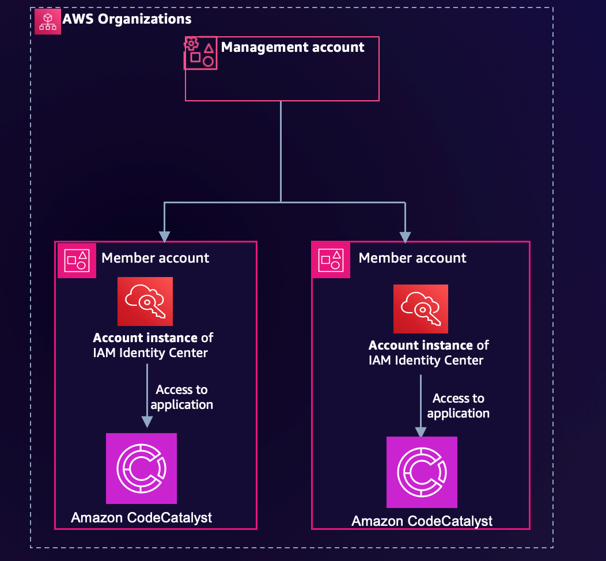
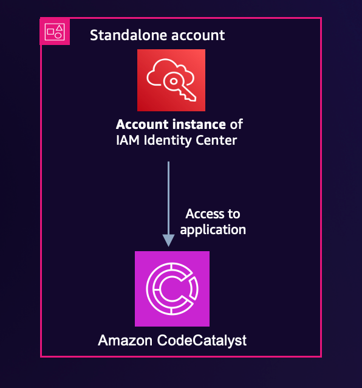
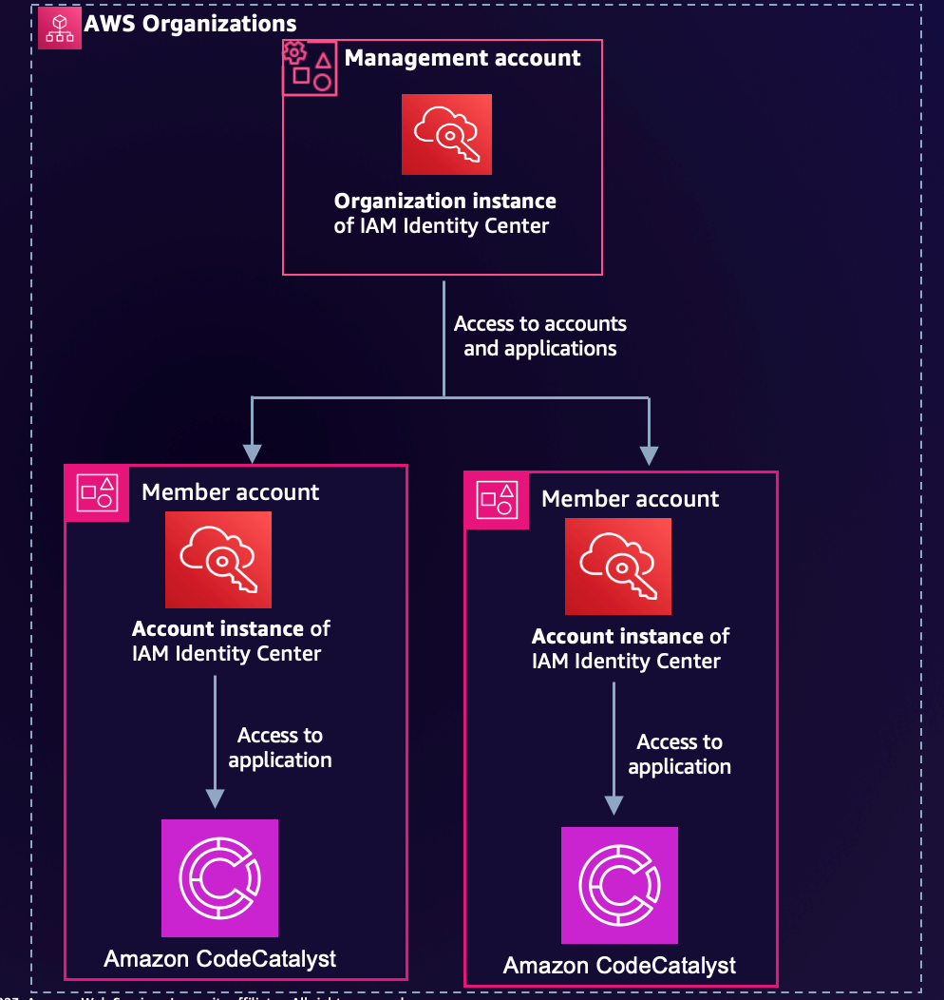

##### AWS IAM Identity Center: 

* (successor to AWS Single Sign-On) is a cloud-based identity and access management (IAM) service that helps you centrally manage and control access to your AWS resources.

###### IAM Identity Center Benefits:

* Single sign-on (SSO) to AWS accounts and applications - IAM Identity Center allows your workforce users to sign in to all their AWS accounts and applications with a single set of credentials. It reduces risk of password fatigue and increases productivity.
* Centralized user management - IAM Identity Center allows you to create, manage, and delete users and groups centrally. This makes it easier to keep track of your users and their permissions.
* Role-based access control (RBAC) - IAM Identity Center supports RBAC, which allows you to grant users permissions to specific AWS resources. This helps you to secure your AWS environment and prevent unauthorized access.
* Fine-grained access control - IAM Identity Center allows you to define fine-grained access control policies for your AWS resources. This helps you to ensure that users only have access to the resources that they need.
* Auditing and reporting - IAM Identity Center provides auditing and reporting capabilities that help you to track user activity and identify potential security risks.
* IAM Identity Center can be used by organizations of all sizes. It is a scalable and cost-effective solution that can help you to improve the security and efficiency of your AWS environment.

Use Cases:

1. To provide SSO to AWS accounts and applications.
2. To centralize user management.
3. To implement RBAC.
4. To define fine-grained access control policies.
5. To track user activity and identify potential security risks.
6. AWS Identity Center Workshop: https://catalog.workshops.aws/iam-identity-center/en-US

[Getting Started](https://catalog.workshops.aws/iam-identity-center/en-US/getting-started)

[AWS Account Setup](https://catalog.workshops.aws/iam-identity-center/en-US/getting-started/account-setup/)
* An AWS account not part of [AWS Organizations](https://aws.amazon.com/organizations) 
[Identity Center prerequisites](https://catalog.workshops.aws/iam-identity-center/en-US/getting-started/identitycenter-prereq/)
* Enable AWS Organizations
* Enable IAM Identity Center

Workshop Modules

* [Module 1 - Create Users and Groups](https://catalog.workshops.aws/iam-identity-center/en-US/workshop/1-ssousersandgroups)
* [Module 2 - Create and Provision Permission Sets](https://catalog.workshops.aws/iam-identity-center/en-US/workshop/2-permissionsets)
* [Module 3 - Test the Setup](https://catalog.workshops.aws/iam-identity-center/en-US/workshop/3-testsetup)

Extra Credit Modules

* [Time Based Access Control](https://catalog.workshops.aws/iam-identity-center/en-US/workshop/4-extracredits/4-tbac)
* [Using Customer Managed Policies](https://catalog.workshops.aws/iam-identity-center/en-US/workshop/4-extracredits/4-cmp)
* [Attribute Bases Access Control](https://catalog.workshops.aws/iam-identity-center/en-US/workshop/4-extracredits/4-abac)
* [Using IAM Identity Center Identity Store APIs](https://catalog.workshops.aws/iam-identity-center/en-US/workshop/4-extracredits/4-Identitystore_apis)
* [Using an external IDP (Okta) with Identity Center](https://catalog.workshops.aws/iam-identity-center/en-US/workshop/4-extracredits/4-externalidp-okta)
* [Using an external IDP (Azure AD) with Identity Center](https://catalog.workshops.aws/iam-identity-center/en-US/workshop/4-extracredits/4-externalidp-azure)
* [Using an external IDP (Ping Federate) with Identity Center](https://catalog.workshops.aws/iam-identity-center/en-US/workshop/4-extracredits/4-externalidp-ping)

##### IAM Identity Center Instance Types

IAM Identity Center now offers two deployment types, the traditional [organization instance](https://docs.aws.amazon.com/singlesignon/latest/userguide/organization-instances-identity-center.html) and an [account instance](https://docs.aws.amazon.com/singlesignon/latest/userguide/account-instances-identity-center.html), shown in Figure 1. In this section, we show you the differences between the two.
 

##### [Use Case Diagrams](https://aws.amazon.com/blogs/security/how-to-use-multiple-instances-of-aws-iam-identity-center/)

##### IAM Identity Center instances deployment patterns
Case 1 (recommended): An organization instance can support multiple AWS managed applications in different accounts. Creation of account instances is disabled after you have an organization instance. 

 

Case 2: An AWS Organizations deployment without an organization instance can create multiple account instances, one per account, to support AWS managed applications in the same account.

 

Case 3: An account instance in a standalone account (not in AWS Organizations) can support AWS managed applications in the same account.

 
Case 4: An AWS Organizations deployment with an organization instance can invite in a standalone account that had an account instance prior to being added to the organization.

